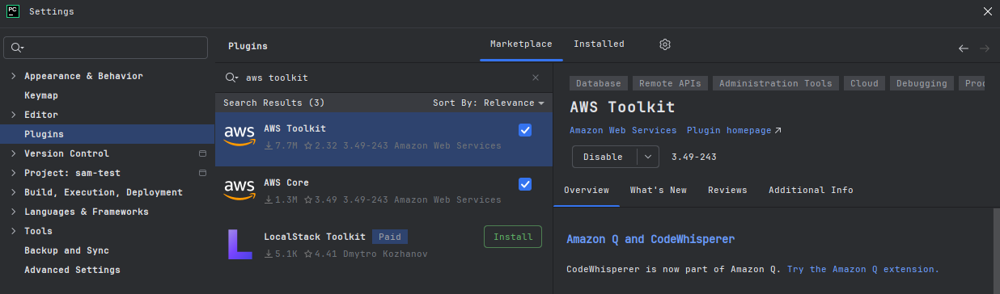
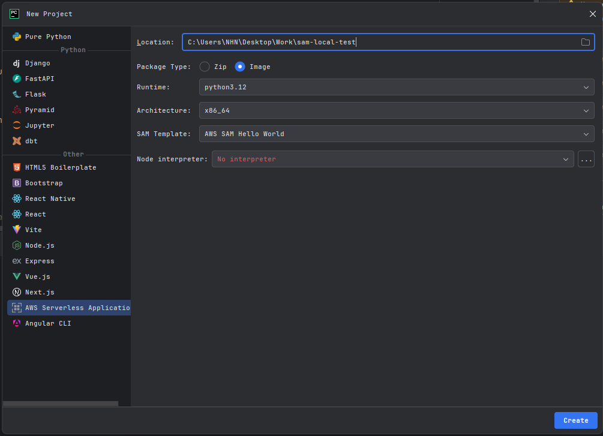
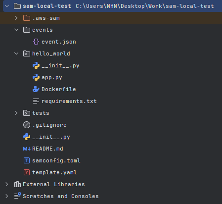
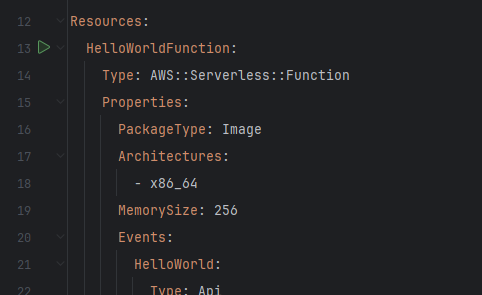
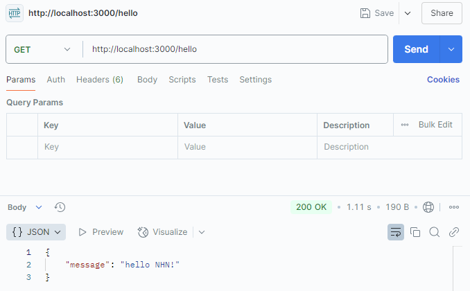

### 요약

> - 요약 내용이 필요하다
> - 요약 내용이 필요하다

### ✅ 시작하며
AWS Lambda 함수에서 직접 백엔드 코드를 호출하고 싶습니다.
하지만 AWS 환경에 있는 Lambda 함수는 로컬 환경에 있는 백엔드 코드를 직접 호출할 수 없습니다.
또한 Lambda 함수를 매번 테스트할 때마다 AWS 환경으로 전환하여 테스트하기에는 무리가 있습니다.

이런 상황에서 Lambda 함수를 AWS 환경이 아닌 로컬 환경에서 구동하고 싶은 생각이 들었고,
AWS SAM(AWS Serverless Application Model)을 활용하여 Lambda 함수를 로컬에서 테스트할 수 있는 환경을 구축하고자 합니다.

---

### ✅ SAM 프로젝트 세팅하기

1. Pycharm IDE에서 `AWS Toolkit` 플러그인 설치가 필요합니다.



2. IDE 재부팅 이후, 새 프로젝트를 생성하여 좌측 하단 'Other' 탭을 펼치고 'AWS Serverless Application' 항목을 선택합니다.



- Package Type : `Image` 항목을 선택합니다.
- SAM Template : `AWS SAM Hello World` 항목을 선택합니다.

3. 아래 그림과 같이 준비되었다면 성공입니다.



---

### ✅ 구성 요소 살펴보기

#### **app.py ⭐**
```python
import json

def lambda_handler(event, context):
    return {
    "statusCode": 200,
    "body": json.dumps(
        {
            "message": "hello NHN!",
        }
    )
}
```
- 메인함수 핸들러를 포함하는 본체 함수입니다.

#### **template.yaml 🍫**
```yaml
AWSTemplateFormatVersion: '2010-09-09'
Transform: AWS::Serverless-2016-10-31
Description: >
  python3.12

  Sample SAM Template for sam-local-test

Globals:
  Function:
    Timeout: 3

Resources:
  HelloWorldFunction:
    Type: AWS::Serverless::Function
    Properties:
      PackageType: Image
      Architectures:
        - x86_64
      MemorySize: 256
      Events:
        HelloWorld:
          Type: Api
          Properties:
            Path: /hello
            Method: get
    Metadata:
      Dockerfile: Dockerfile
      DockerContext: ./hello_world
      DockerTag: python3.12-v1

Outputs:
  HelloWorldApi:
    Description: "API Gateway endpoint URL for Prod stage for Hello World function"
    Value: !Sub "https://${ServerlessRestApi}.execute-api.${AWS::Region}.amazonaws.com/Prod/hello/"
  HelloWorldFunction:
    Description: "Hello World Lambda Function ARN"
    Value: !GetAtt HelloWorldFunction.Arn
  HelloWorldFunctionIamRole:
    Description: "Implicit IAM Role created for Hello World function"
    Value: !GetAtt HelloWorldFunctionRole.Arn
```
- Lambda 함수와 관련된 AWS 리소스 및 여러 설정을 정의합니다.
- Docker 이미지를 사용하는 경우 이를 참조합니다.

#### **Dockerfile 🐳**
```dockerfile
FROM public.ecr.aws/lambda/python:3.12
COPY app.py requirements.txt ./
RUN python3.12 -m pip install -r requirements.txt -t .
CMD ["app.lambda_handler"]
```
- Lambda 함수를 실행할 이미지를 커스터마이징할 때 사용합니다.

---

### ✅ Lambda 함수 실행하기

Lambda 함수를 실행하는 방법은 두 가지이고, 실행 결과는 똑같습니다.

1. 커맨드 입력을 통한 실행
```
sam build
sam local invoke HelloWorldFunction -e events/event.json
```

2. template.yaml 파일 내에서 실행



좌측 초록색 실행 버튼을 누르면 됩니다.

---

### ✅ 로컬 서버 실행하기

아래 커맨드를 통해 Lambda 함수를 로컬 서버로 실행할 수 있습니다.

```
sam local start-api
```

```{6}
Initializing the lambda functions containers.
Building image.................
Using local image: helloworldfunction:rapid-x86_64.

Containers Initialization is done.
Mounting HelloWorldFunction at http://127.0.0.1:3000/hello [GET]
You can now browse to the above endpoints to invoke your functions. You do not need to restart/reload SAM CLI while working on your functions, changes will be reflected
instantly/automatically. If you used sam build before running local commands, you will need to re-run sam build for the changes to be picked up. You only need to       
restart SAM CLI if you update your AWS SAM template
2025-01-21 11:25:18 WARNING: This is a development server. Do not use it in a production deployment. Use a production WSGI server instead.
 * Running on http://127.0.0.1:3000
```
- localhost 3000번 포트에서 구동되고 있는 것을 볼 수 있다.
- 주의 : 로컬 서버 구동 시, `Docker`가 구동되고 있어야 합니다!


