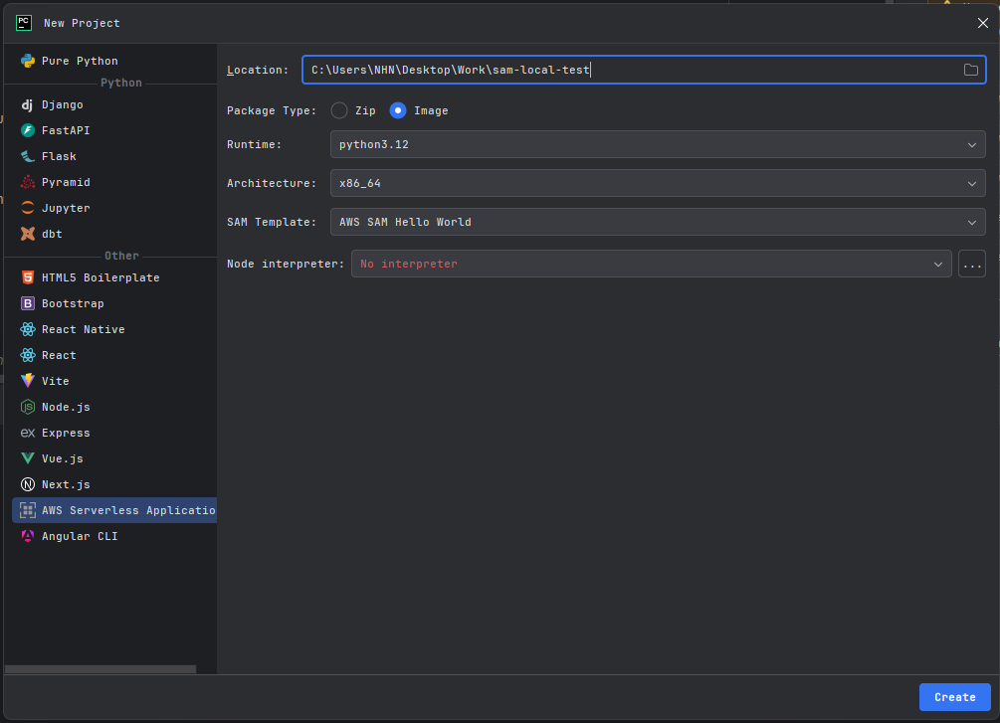
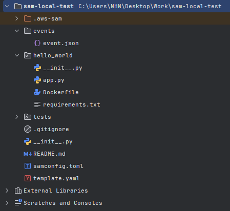

### 요약

> - 요약 내용이 필요하다
> - 요약 내용이 필요하다

### 시작하며
AWS Lambda 함수에서 직접 백엔드 코드를 호출하고 싶습니다.
하지만 AWS 환경에 있는 Lambda 함수는 로컬 환경에 있는 백엔드 코드를 직접 호출할 수 없습니다.
또한 Lambda 함수를 매번 테스트할 때마다 AWS 환경으로 전환하여 테스트하기에는 무리가 있습니다.

이런 상황에서 Lambda 함수를 AWS 환경이 아닌 로컬 환경에서 구동하고 싶은 생각이 들었고,
AWS SAM(AWS Serverless Application Model)을 활용하여 Lambda 함수를 로컬에서 테스트할 수 있는 환경을 구축하고자 합니다.

---

### SAM 프로젝트 세팅하기

1. Pycharm IDE에서 `AWS Toolkit` 플러그인 설치가 필요합니다.


2. IDE 재부팅 이후, 새 프로젝트를 생성하여 좌측 하단 'Other' 탭을 펼치고 'AWS Serverless Application' 항목을 선택합니다.



- Package Type : `Image` 항목을 선택합니다.
- SAM Template : `AWS SAM Hello World` 항목을 선택합니다.

3. 아래 그림과 같이 준비되었다면 성공입니다.



### 구성 요소 살펴보기

**app.js**
```python
def lambda_handler(event, context):
    return {
    "statusCode": 200,
    "body": json.dumps(
        {
            "message": "hello NHN!",
        }
    ),
}
```

### Lambda 함수 실행하기

####