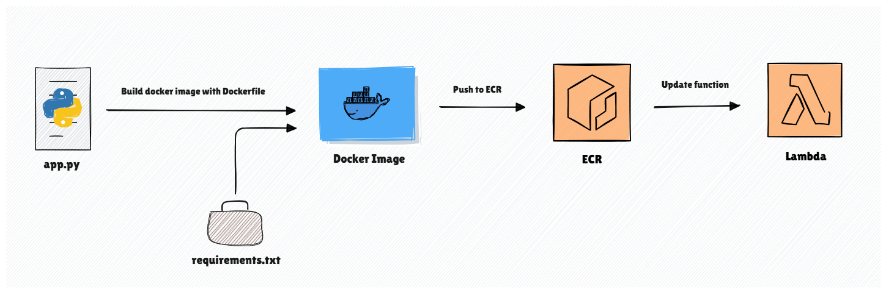

### 💡 요약

> - AWS Lambda에 코드를 배포하는 방식은 두 가지가 있습니다.
> - Github Actions를 활용하여 로컬에 있는 람다 함수를 AWS 상에 배포할 수 있습니다.

### ✅ 시작하며

[**이전 글**](https://charliebrown.co.kr/aws-sam-localhost/)을 통해, 이제 로컬 환경에서 AWS Lambda를 테스트 할 수 있었습니다.
로컬 환경에서 만든 코드를 AWS Lambda에 배포하기까지, 모든 과정을 자동화 해보도록 하겠습니다.

---

### ✅ AWS Lambda에 코드를 배포하는 방식

AWS Lambda에 코드를 배포하는 방식은 두 가지입니다. 각각의 장단점에 대해 설명해보겠습니다.

**1️⃣ zip 파일 + layer 방식**
|            **장점 😀**             |            **단점 ☹️**             | 
|:------------------------------:|:------------------------------:|
| 파일의 크기가 작으면, 배포 속도가 빠름 |  zip 파일 + layer를 포함하여 <br> 압축 해제를 기준으로 250MB 용량 제한  |
| 별도의 컨테이너 이미지가 없어, <br> AWS Lambda 환경에서 바로 실행 가능 | AWS에서 제공하는 런타임을 사용해야하며, <br> 특정 버전의 패키지가 필요시 환경 설정이 어려움 |
| layer를 활용하면, 여러 Lambda 함수에서 <br> 공통 라이브러리로 공유 가능 | 특정 OS 종속적인 라이브러리를 <br> 포함해야 하는 경우 어려움 |

**2️⃣ Docker 이미지 방식**
|            **장점 😀**             |            **단점 ☹️**             |
|:------------------------------:|:------------------------------:|
| 패키지 크기의 제한이 없음 |  이미지 빌드부터 푸시까지 시간이 <br> 오래 걸려 배포 속도가 느림 |
| 특정 OS 패키지 상관없이 <br> 커스텀 환경을 자유롭게 구축 가능 | 컨테이너 기반 실행으로 인한 Cold Start가 <br> 발생하여, 시작 시간이 길어질 수 있음 |
| 로컬에서 테스트한 환경 그대로 배포 가능하여, <br> 일관된 환경 및 실행 결과를 보장 | Dockerfile 작성, ECR 관리, 이미지 최적화 등 <br> 운영 복잡성 증가 |

따라서, 가벼운 서비스라면 'zip 파일 + layer 방식'이 좋지만, 용량이 크거나 복잡한 환경이 필요한 경우, 혹은 운영에 자신이 있다면 'Docker 이미지 방식'을 선택하면 됩니다.
이번 포스팅에서는 'Docker 이미지 방식'을 사용하여 AWS Lambda 배포를 자동화 해보겠습니다.

---

### ✅ Github Actions를 선택한 이유

비슷한 CI/CD 도구인 'Jenkins'도 있는데, 선택에 이유에는 아래와 같은 내용이 존재합니다.

- 코드 저장소를 Github에 구축하였음
- 팀에서 현재 Jenkins 인프라는 운영하고 있지 않아, 설치 및 유지보수 비용이 꽤 필요함
- 간단하고 빠르게 CI/CD 파이프라인을 구축하는 것이 1순위 목표임
- AWS를 다루는 명령어들이 Actions 내부에 준비되어 있어 설정이 간단함

따라서 스크립트 파일 하나로 Docker 이미지 빌드, ECR 안에 이미지 업로드, Lambda 함수 업데이트까지 진행할 수 있는 Github Actions를 선택하게 되었습니다.

---

### ✅ 아키텍처 구상



---

### ✅ 스크립트 코드
```yaml
name: Deploy docker image on AWS Lambda

on:
  push:
    branches: [ "main" ]
    paths:
      - 'modules/ai-model/**'                    # 모듈마다 스크립트 관리 가능
      - ".github/workflows/deploy-ai-model.yml"  # 스크립트 원본 변경 시에도 workflow 실행

jobs:
  deploy:
    runs-on: ubuntu-latest

    steps:
      # Step 1: Checkout the repository
      - name: Checkout repository
        uses: actions/checkout@v3

      # Step 2: Assume IAM Role to get temporary credentials
      - name: Assume IAM Role
        id: assume-role
        env:
          ROLE_ARN: ${{ secrets.AWS_ROLE_ARN }}
          AWS_REGION: ${{ secrets.AWS_REGION }}
          AWS_ACCESS_KEY_ID: ${{ secrets.AWS_ACCESS_KEY_ID }}
          AWS_SECRET_ACCESS_KEY: ${{ secrets.AWS_SECRET_ACCESS_KEY }}
        run: |
          SESSION_NAME="GitHubActionsSession"
          CREDS=$(aws sts assume-role --role-arn $ROLE_ARN --role-session-name $SESSION_NAME --query 'Credentials' --output json)  # STS 사용
          echo "AWS_ACCESS_KEY_ID=$(echo $CREDS | jq -r '.AccessKeyId')" >> $GITHUB_ENV
          echo "AWS_SECRET_ACCESS_KEY=$(echo $CREDS | jq -r '.SecretAccessKey')" >> $GITHUB_ENV
          echo "AWS_SESSION_TOKEN=$(echo $CREDS | jq -r '.SessionToken')" >> $GITHUB_ENV

      # Step 3: Authenticate Docker to ECR
      - name: Authenticate Docker to ECR
        env:
          AWS_ACCESS_KEY_ID: ${{ env.AWS_ACCESS_KEY_ID }}
          AWS_SECRET_ACCESS_KEY: ${{ env.AWS_SECRET_ACCESS_KEY }}
          AWS_SESSION_TOKEN: ${{ env.AWS_SESSION_TOKEN }}
        run: |
          AWS_REGION=${{ secrets.AWS_REGION }}
          ACCOUNT_ID=$(aws sts get-caller-identity --query 'Account' --output text)
          aws ecr get-login-password --region $AWS_REGION | docker login --username AWS --password-stdin $ACCOUNT_ID.dkr.ecr.$AWS_REGION.amazonaws.com

      # Step 4: Build Docker image
      - name: Build Docker Image
        run: |
          cd modules/ai-model
          IMAGE_NAME="ai-model"
          TAG="latest"
          docker build -t "$IMAGE_NAME:$TAG" .

      # Step 5: Tag the Docker image
      - name: Tag Docker image
        run: |
          IMAGE_NAME="ai-model"
          TAG="latest"
          ACCOUNT_ID=$(aws sts get-caller-identity --query 'Account' --output text)
          AWS_REGION=${{ secrets.AWS_REGION }}
          ECR_REPOSITORY_NAME=${{ secrets.ECR_REPOSITORY_NAME }}
          docker tag "$IMAGE_NAME:$TAG" "$ACCOUNT_ID.dkr.ecr.$AWS_REGION.amazonaws.com/$ECR_REPOSITORY_NAME:$TAG"

      # Step 6: Push the Docker image to ECR
      - name: Push Docker image to ECR
        env:
            ECR_REPOSITORY_NAME: ${{ secrets.ECR_REPOSITORY_NAME }}
        run: |
          ACCOUNT_ID=$(aws sts get-caller-identity --query 'Account' --output text)
          AWS_REGION=${{ secrets.AWS_REGION }}
          ECR_REPOSITORY_NAME=${{ secrets.ECR_REPOSITORY_NAME }}
          TAG="latest"
          docker push "$ACCOUNT_ID.dkr.ecr.$AWS_REGION.amazonaws.com/$ECR_REPOSITORY_NAME:$TAG"

      # Step 7: Update lambda function
      - name: Update main function
        env:
          AWS_REGION: ${{ secrets.AWS_REGION }}
          AWS_ACCESS_KEY_ID: ${{ env.AWS_ACCESS_KEY_ID }}
          AWS_SECRET_ACCESS_KEY: ${{ env.AWS_SECRET_ACCESS_KEY }}
          AWS_SESSION_TOKEN: ${{ env.AWS_SESSION_TOKEN }}
        run: |
          FUNCTION_NAME=${{ secrets.LAMBDA_FUNCTION_NAME }}
          ACCOUNT_ID=$(aws sts get-caller-identity --query 'Account' --output text)
          AWS_REGION=${{ secrets.AWS_REGION }}
          ECR_REPOSITORY_NAME=${{ secrets.ECR_REPOSITORY_NAME }}
          TAG="latest"
          aws lambda update-function-code --function-name $FUNCTION_NAME --image-uri "$ACCOUNT_ID.dkr.ecr.$AWS_REGION.amazonaws.com/$ECR_REPOSITORY_NAME:$TAG"

          echo "Waiting for function update to complete..."
          while true; do
            STATUS=$(aws lambda get-function --function-name $FUNCTION_NAME --query 'Configuration.LastUpdateStatus' --output text)
            if [ "$STATUS" = "Successful" ]; then
              echo "Function update completed successfully."
              break
            elif [ "$STATUS" = "Failed" ]; then
              echo "Function update failed."
              exit 1
            else
              echo "Function status: $STATUS. Waiting..."
              sleep 10
            fi
          done

          echo "Lambda function updated with new image"
```
- 도커 이미지를 만드는 과정은 **Step 4 ~ Step 5**에 해당합니다.
- 위 단계에서 만든 도커 이미지는 **Step 6**에서 ECR에 배포합니다.
- **Step 7**에서 `aws lambda update-function-code` 커맨드를 활용하여 람다 함수를 업데이트합니다.
