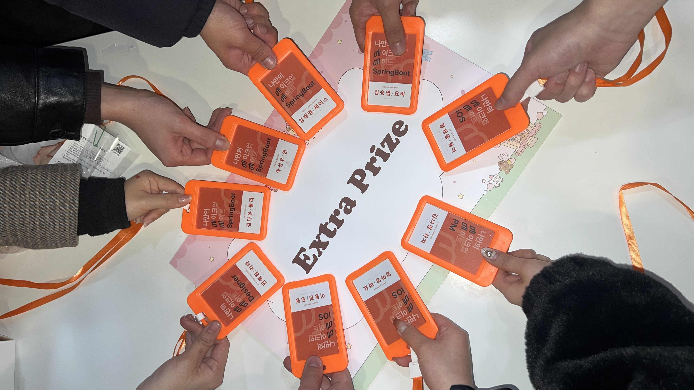
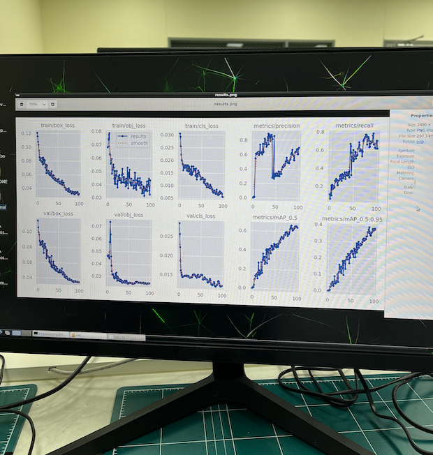
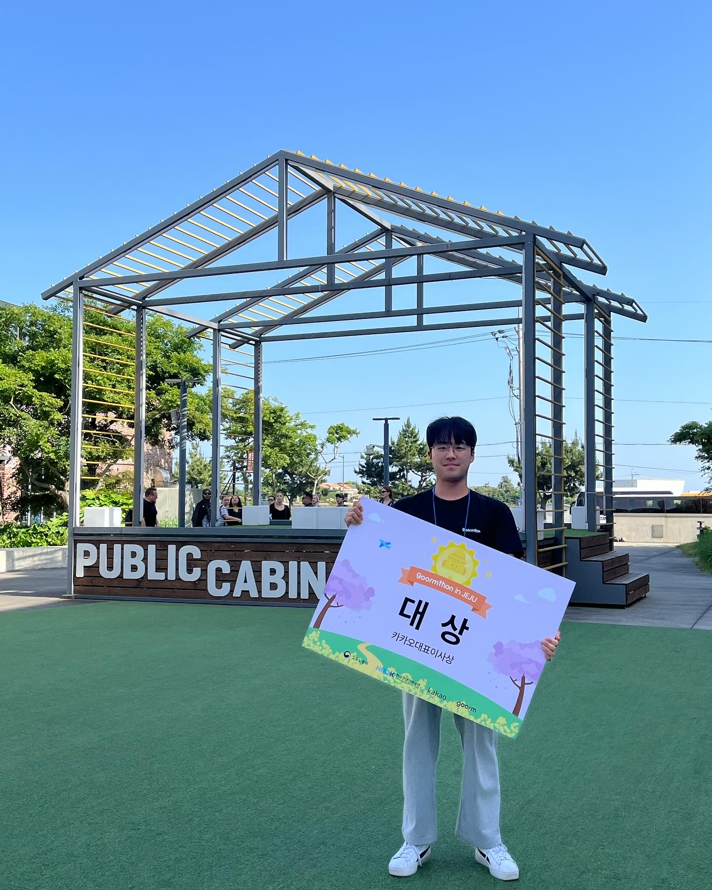
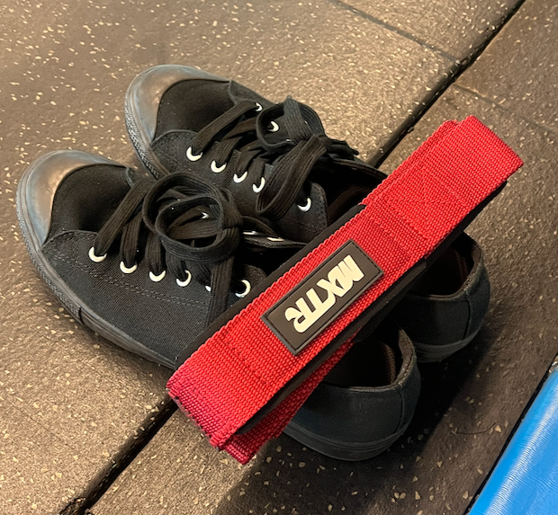
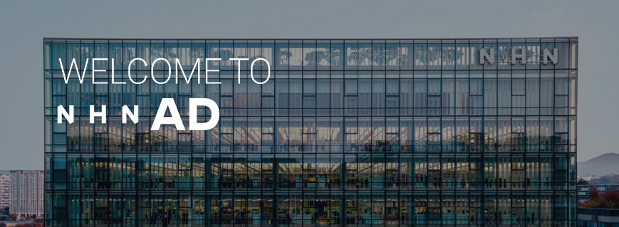
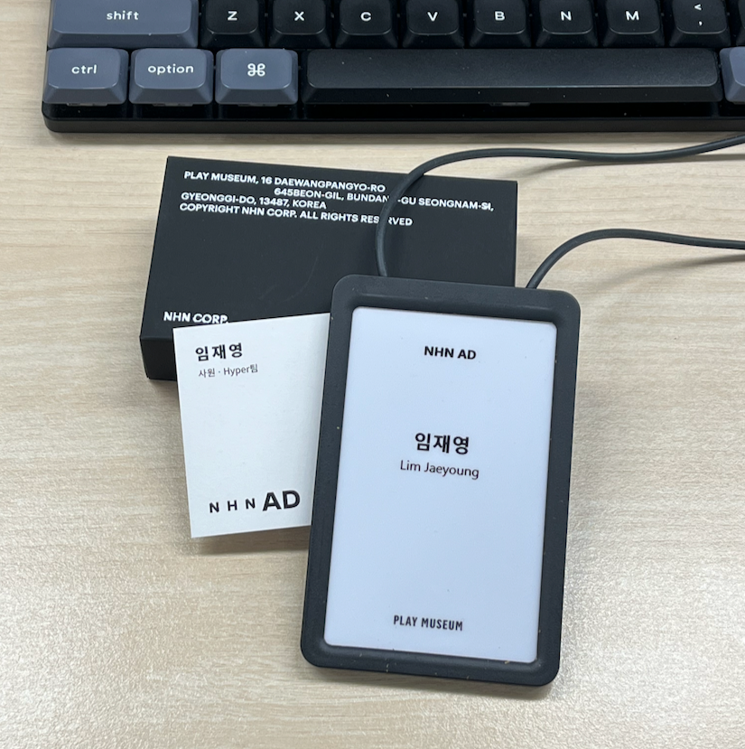

개발자 임재영의 2024년 회고록입니다! 😀

### 1월 - 2월 💄

---
- UMC 5th 데모데이를 위해 ‘나만의 메이크업 메이트 : 메메(MEME)’ 프로젝트에 합류
- 데모데이까지 완벽한 구현은 못 했지만, 부스 홍보도 열심히 준비했기에 **인기상** 수상
- 앞으로 같이 성장할 수 있는 좋은 동료들을 만났던 달
---

대학생 IT 연합동아리 'UMC'는 방학 기간마다 데모데이를 진행합니다.
2023년도 겨울 방학에는 "나만의 메이크업 메이트 : 메메(MEME)" 프로젝트에 합류하여 데모데이를 준비했습니다.

초기 멤버 구성에서 백엔드는 4명이었고, 백엔드 파트 리더를 맡게 되었습니다.
팀원들의 개인적인 목표도 듣고, 도입하고 싶은 기술들도 적용해보며 두 달 동안 프로젝트를 진행하였습니다.
저는 23년도 2학기 때 대학교에서 '분산시스템' 과목을 수강하고 MSA에 관심이 생겨 프로젝트에 도입하기도 했습니다.
간단한 MSA 구조를 적용해보며, 새롭게 배우는 부분들이 많아서 좋았습니다.

데모데이까지 완벽한 구현은 못 했지만, 부스 홍보도 열심히 준비했기에 인기상을 수상할 수 있었습니다.
앞으로 같이 공부하며 발전할 수 있는 동료들을 만난 것 같아 좋았습니다.
데모데이는 끝났지만, 모두가 뜻이 맞아 앞으로도 계속 함께하기로 했습니다!

MEME 팀의 깃허브는 [여기](https://github.com/MEME-UMC)를 참고해주세요!

### 3월 - 4월 📷

---
- 매일 백엔드만 했던 나에게, 인공지능을 활용한 첫 프로젝트 진행 (YOLO 모델 활용)
- 지원서 작성 및 코딩 테스트 준비를 통한 꾸준한 취준 대비
---

학기가 시작되고, 인공지능을 활용한 첫 프로젝트를 진행할 수 있었습니다.
이미지 내 객체 탐지를 하는 것이 프로젝트의 목표였기 때문에, YOLO 모델을 사용하였습니다.
백엔드 개발과 많이 달랐기 때문에, 배우는 부분도 많았고 신기한 점도 많았습니다.
데이터를 통해 인공지능 모델을 학습시키고, 사람들이 사용할 수 있도록 모델을 서빙하는 것도 하나의 가치(value)가 되는 것에 흥미가 생겼습니다.

또한 상반기 취업 시장이 열리는 기간이기 때문에, 자기소개서나 코딩 테스트 준비를 통해 꾸준하게 취준을 대비하였습니다.
자기소개서도 계속 써보면서 부족한 부분도 파악하고, 코딩 테스트는 자료구조를 리마인드하는데 큰 도움이 되었고, 실제로 프로젝트 리팩토링 과정에 적용도 해보았습니다.

### 5월 🏆

---
- 구름톤 10기 **카카오대표이사상(대상)** 수상
- ‘제주도에서 열리는 해커톤’은 새로운 경험이었고, 흔치 않은 기회였기에 누구보다 치열하게 준비
- 3박 4일동안 같이 고생한 뿌리팀 형누나들! 인생에 좋은 선배들을 만나 든든합니다!
---

학교 수업을 듣는 와중.. 덜컥 합격 문자를 받았습니다!
"구름톤 10기에 합격했으니, 제주도로 오세요!" 라는 말에 바로 숙소와 비행기를 예약했습니다.
해커톤은 많이 해봤지만 제주도에서 열리는 대기업의 해커톤은 흔치 않은 기회이기에, 많은 준비를 해서 가야겠다는 생각을 했습니다.

일주일 정도의 준비 기간동안, 백엔드 개발자로서 어떤 것들을 준비해야할지 고민이 많았습니다.
해커톤은 정해진 시간안에 원하는 목표를 달성하기 위한 '협업'이 중요합니다.
따라서 FE 파트와 협업을 위한 API 명세서를 미리 준비했습니다.

그동안 경험했던 해커톤은 같은 파트 개발자가 2명 이상 있었는데, 구름톤은 백엔드 파트가 1명이었기에 ERD 설계, 백엔드 코드 작성, 배포까지 모두 혼자 담당해야 했습니다.
해커톤은 항상 시간이 부족했기에, 미리 배포 관련 공부를 하여 본 대회 때 문제가 없도록 하고 싶었습니다.
구름톤의 메인 배포툴은 컨테이너 기반의 '크램폴린IDE'를 사용했습니다.
따라서 쿠버네티스 관련 지식을 많이 공부하고, 실제로 실습까지 진행해보며 백엔드 단독 서버만 띄울 수 있는 단계까지 준비했습니다.

누구보다 치열하게 먼저 준비하고, 본 대회 때도 팀원들과 열심히 고생한 결과.. 
6개 팀 중에서 최종 1등을 하여 **카카오대표이사상(대상)** 을 수상하였습니다. 
또한, 해커톤뿐만 아니라 현직자분들의 강의도 듣고, 비어파티를 통해 네트워킹도 하며 좋은 시간을 보냈습니다.
이번에 참가한 구름톤은 앞으로 개발자로서 인생을 사는데, 더할 나위 없는 좋은 선물이 되었다고 생각합니다.

'뿌리' 프로젝트에 대한 설명은 [여기](https://9oormthon.goorm.io/83182701-089a-4441-8589-c072b4102fe6)를 참고해주세요!

### 6-7월 💪🏻

---
- 방학 때는 본가로 내려와서 ‘밥 + 운동 + 개발’ 사이클의 반복
- 머신러닝 분야의 산학협력 프로젝트 참여 제의가 들어왔고, 진로에 대한 고민이 많았던 시기
---

방학을 하고, 본가에 내려왔습니다.
평소에 하고 싶은 것들을 마음껏 했고, 좋아하는 야구도 많이 보러 다녔습니다.
매일 밥 먹고, 운동하고, 개발하는 사이클의 반복이었습니다. 행복 만땅 낭만의 시기!

올해 초에 시작했던 MEME는 글을 작성하는 현재도 꾸준히 리팩토링 중입니다.
기능도 꾸준히 추가 중에 있는데, 그 중에서 '실시간 예약' 서비스가 추가되었고, 제가 담당하여 개발하였습니다.
실시간 예약이기 때문에 동시성 제어가 필요하고, Redis를 활용한 분산 락 방식을 통해 실시간 예약을 구현하였습니다.

그러던 중, 머신러닝 분야의 산학협력 프로젝트 참여 제의가 들어왔습니다.
이는 저의 내면적으로 진로에 대한 많은 고민을 안겨주었습니다.
제 나름대로 비유하자면 백엔드는 '우완 정통파 투수' 이고, 인공지능은 '좌완 파이어볼러 투수' 라고 할 수 있겠는데..
인공지능을 하는데 약간의 두려움도 있었습니다. (대학원 진학 이슈.. 백엔드로 경험 쌓고 있는데 갑자기 다른 분야를 해야하니까.. 등등)
하지만 인공지능을 하는 것이 앞으로 개발자를 하는데 도움이 될 것이라는 믿음이 있었기에, 새로운 분야를 시도해보았습니다.

### 8월 - 10월 👟

---
- 산학협력 프로젝트 진행을 위해 3개월 동안 NHN AD로 인턴 실습
- 인턴 기간동안 인프라 구축, 모델 개발, 데이터 관리 등의 업무 수행
- 프로젝트 열심히 진행하며, 주도적으로 사내에 서비스도 배포해보며 많은 경험 축적
---

산학협력 프로젝트를 본격적으로 시작하기 위해, NHN AD로 인턴을 가게 되었습니다.
처음 해보는 직장 생활에, 설레기도 했고 긴장도 했습니다.
그래서 인턴 입사 첫날이 가장 기억에 남습니다.

사실 인턴은 업무를 하기에 제한적인 직급이라고 생각하는데, 인턴 기간동안 사내에 있는 많은 경험을 할 수 있어서 좋았습니다.
AWS 자원을 사용하여 데이터 관리, 머신러닝 모델 개발, 인프라 구축을 경험할 수 있었습니다.
특히 Lambda를 적극적으로 활용하여 서버리스 형태를 많이 다룰 수 있었고, SageMaker AI를 활용하여 모델 개발을 편리하게 할 수 있었습니다.
또한 모든 인프라는 IaC 방식으로 CDK를 통해 관리하는 방법도 배웠습니다.

기술적인 부분과 다르게, 협업 및 커뮤니케이션 능력을 기르는 데에도 집중하였습니다.
노션이나 슬랙을 적극적으로 활용하여 협업을 편리하게 하고, 나의 커뮤니케이션 방식을 분석하고 피드백도 받으며
앞으로 회사 생활에서 다른 사람들과 어떻게 커뮤니케이션을 할 수 있는지 배우는 시간이었습니다.

### 11월 - 12월 👔

---
- 정규직 전환에 성공하고 새로운 팀도 신설
- 현재는 머신러닝을 활용한 애드테크 플랫폼을 개발하는 팀의 MLOps Engineer 역할
- 학생 때보다, 개발을 보는 눈이 넓어진 느낌? 삶도 많이 달라졌다!
---

인턴 기간동안 프로젝트도 열심히 진행하고, NHN AD 전사에 서비스도 배포해보며 많은 경험을 할 수 있었습니다.
정규직 전환 의지도 있었고 회사에서도 좋게 봐주신 덕분에, 첫 정규직 전환에 성공했습니다!

현재는 머신러닝을 활용한 애드테크(Ad-Tech) 플랫폼을 개발하는 팀에서 근무하고 있고, 팀 내에서 맡은 역할은 MLOps Engineer 입니다.
NHN 본사는 판교지만, 개발팀은 강남에서 근무하고 있습니다.
본사도 교육 들으러 한번 가보았는데, 손에 꼽는 국내 IT 기업답게 건물도 크고 여러 복지도 누릴 수 있어 좋았습니다.

첫 직장도 빨리 잡았고, 현재 연차에 비해 다양한 경험을 할 수 있어 앞으로의 회사 생활이 기대됩니다.
많은 사람들에게 꼭 필요한 개발자가 되는 것이 목표입니다.

### Welcome 2025 🚀

2024년은 더 좋은 개발자로서 성장하는데 필요한 경험과, 같이 성장할 수 있는 좋은 사람들, 수상을 통한 '할 수 있다' 라는 자신감을 쌓았습니다.
어려운 취업 시장 속에서 첫 보금 자리도 잡게 되어, 항상 고맙고 감사할 따름입니다.

작년 저의 키워드는 '성장' 이었습니다. 올해는 '집중' 이라는 단어를 새기고 싶습니다.
현재 속한 분야에 집중하며 전문적인 역량들을 키우고 싶습니다.
다가오는 새해에도 다들 좋은 일만 가득하길 바랍니다!